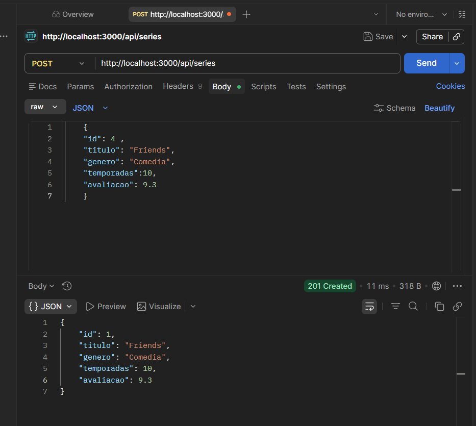
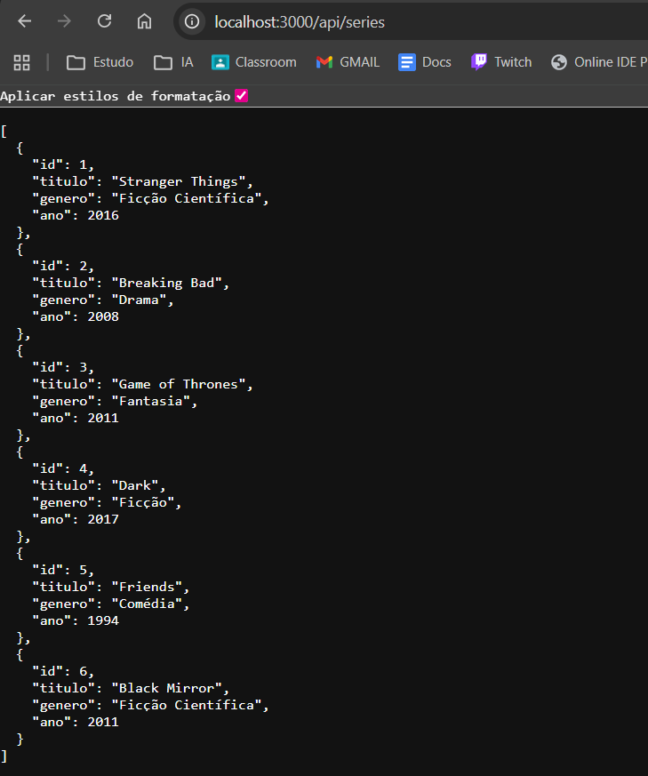

# API de Séries 🎬

API REST para gerenciamento de séries de TV, desenvolvida com **Node.js** e **Express**.

---

## Sumário

- [Sobre o Projeto](#sobre-o-projeto)
- [Tecnologias](#tecnologias)
- [Como Executar](#como-executar)
- [Estrutura do Projeto](#estrutura-do-projeto)
- [Endpoints da API](#endpoints-da-api)
  - [GET /api/series](#1-listar-todas-as-séries)
  - [GET /api/series/:id](#2-buscar-série-por-id)
  - [POST /api/series](#3-criar-nova-série)
- [Validações Implementadas](#validações-implementadas)
- [Exemplos de Requisição no Postman](#exemplos-de-requisição-no-postman)
- [Capturas de Tela dos Testes](#capturas-de-tela-dos-testes)
- [Dados Iniciais](#dados-iniciais)

---

## Sobre o Projeto

Esta API permite listar, buscar e cadastrar séries de TV. Os dados são armazenados em memória (array no controller). As 3 primeiras séries foram cadastradas diretamente no código-fonte (VSCode), e as demais foram adicionadas via Postman.

---

## Tecnologias

- **Node.js**
- **Express 5.2**
- **Postman** (para testes de API)

---

## Como Executar

```bash
# Instalar dependências
npm install

# Iniciar o servidor
npm start
```

O servidor será iniciado em `http://localhost:3000`.

---

## Estrutura do Projeto

```
api-series/
├── assets/                  # Capturas de tela dos testes
├── controllers/
│   └── seriesController.js  # Lógica dos endpoints (CRUD)
├── routes/
│   └── seriesRoutes.js      # Definição das rotas
├── server.js                # Configuração do Express e porta
├── package.json
└── README.md
```

---

## Endpoints da API

### 1. Listar todas as séries

| Campo     | Valor                              |
|-----------|-------------------------------------|
| **Método**  | `GET`                              |
| **URL**     | `http://localhost:3000/api/series`  |
| **Body**    | Nenhum                             |

**Resposta — `200 OK`:**

```json
[
  {
    "id": 1,
    "titulo": "Stranger Things",
    "genero": "Ficção Científica",
    "ano": 2016
  },
  {
    "id": 2,
    "titulo": "Breaking Bad",
    "genero": "Drama",
    "ano": 2008
  }
]
```

> Retorna um array JSON com todas as séries cadastradas.

---

### 2. Buscar série por ID

| Campo     | Valor                                   |
|-----------|-----------------------------------------|
| **Método**  | `GET`                                  |
| **URL**     | `http://localhost:3000/api/series/:id` |
| **Body**    | Nenhum                                 |

**Exemplo:** `GET http://localhost:3000/api/series/3`

**Resposta — `200 OK`:**

```json
{
  "id": 3,
  "titulo": "Game of Thrones",
  "genero": "Fantasia",
  "ano": 2011
}
```

**Resposta de erro — `404 Not Found` (ID inexistente):**

```json
{
  "erro": "Serie nao encontrada."
}
```

---

### 3. Criar nova série

| Campo     | Valor                              |
|-----------|-------------------------------------|
| **Método**  | `POST`                             |
| **URL**     | `http://localhost:3000/api/series`  |
| **Headers** | `Content-Type: application/json`   |
| **Body**    | JSON (raw)                         |

**Body da requisição:**

```json
{
  "titulo": "Black Mirror",
  "genero": "Ficção Científica",
  "ano": 2011
}
```

**Resposta — `201 Created`:**

```json
{
  "id": 6,
  "titulo": "Black Mirror",
  "genero": "Ficção Científica",
  "ano": 2011
}
```

> O campo `id` é gerado automaticamente pela API.

**Resposta de erro — `400 Bad Request` (sem título):**

```json
{
  "erro": "O campo titulo e obrigatorio."
}
```

---

## Validações Implementadas

A API possui as seguintes validações no endpoint `POST /api/series`:

| Validação | Descrição | Resposta |
|-----------|-----------|----------|
| **Título obrigatório** | O campo `titulo` é obrigatório. Se não for enviado, a API retorna erro `400`. | `{ "erro": "O campo titulo e obrigatorio." }` |
| **Campos opcionais** | Os campos `genero` e `ano` são opcionais. Se não forem informados, serão salvos como `null`. | Série criada com campos `null` |
| **ID automático** | O `id` é gerado automaticamente com base no tamanho do array (`series.length + 1`). | ID sequencial |

No endpoint `GET /api/series/:id`:

| Validação | Descrição | Resposta |
|-----------|-----------|----------|
| **Série não encontrada** | Se o `id` informado não existir no array, retorna erro `404`. | `{ "erro": "Serie nao encontrada." }` |
| **Conversão de tipo** | O parâmetro `id` da URL é convertido para `Number` antes da busca. | Garante comparação correta |

---

## Exemplos de Requisição no Postman

### Exemplo 1 — POST para criar "Friends"

**Configuração no Postman:**
- Método: `POST`
- URL: `http://localhost:3000/api/series`
- Body → raw → JSON:

```json
{
  "titulo": "Friends",
  "genero": "Comédia",
  "ano": 1994
}
```

**Resultado:** `201 Created` — Série criada com sucesso.

---

### Exemplo 2 — POST para criar "Black Mirror"

**Configuração no Postman:**
- Método: `POST`
- URL: `http://localhost:3000/api/series`
- Body → raw → JSON:

```json
{
  "titulo": "Black Mirror",
  "genero": "Ficção Científica",
  "ano": 2011
}
```

**Resultado:** `201 Created` — Série criada com sucesso.

---

### Exemplo 3 — GET para listar todas as séries

**Configuração no Postman:**
- Método: `GET`
- URL: `http://localhost:3000/api/series`

**Resultado:** `200 OK` — Retorna o array com todas as séries.

---

### Exemplo 4 — GET para buscar série por ID

**Configuração no Postman:**
- Método: `GET`
- URL: `http://localhost:3000/api/series/1`

**Resultado:** `200 OK` — Retorna os dados de "Stranger Things".

---

## Capturas de Tela dos Testes

### POST no Postman — Criando "Friends"



### POST no Postman — Criando "Black Mirror"



---

## Dados Iniciais

As 3 primeiras séries foram cadastradas diretamente no código-fonte (`seriesController.js`). As séries 4 a 7 foram adicionadas via Postman.

| ID | Título           | Gênero              | Ano  | Origem   |
|----|------------------|----------------------|------|----------|
| 1  | Stranger Things  | Ficção Científica    | 2016 | VSCode   |
| 2  | Breaking Bad     | Drama                | 2008 | VSCode   |
| 3  | Game of Thrones  | Fantasia             | 2011 | VSCode   |
| 4  | Dark             | Ficção               | 2017 | Postman  |
| 5  | Friends          | Comédia              | 1994 | Postman  |
| 6  | Black Mirror     | Ficção Científica    | 2011 | Postman  |
| 7  | The Office       | Comédia              | 2005 | Postman  |

---

> Projeto desenvolvido para prática de criação de APIs REST com Node.js e Express.
